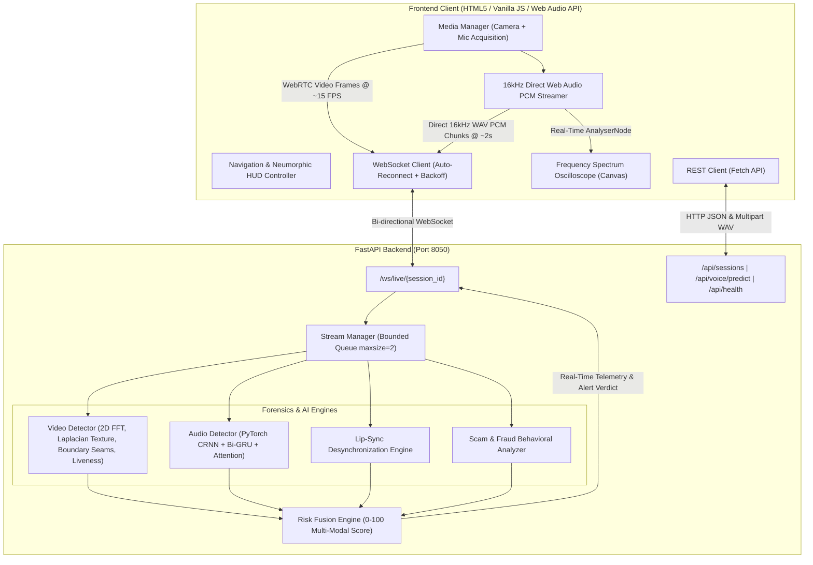

# 🛡️ DeepShield AI — Real-Time Deepfake Voice & Video Scam Detection System

[](https://www.python.org/)
[](https://fastapi.tiangolo.com/)
[](https://pytorch.org/)
[](https://opencv.org/)
[](https://websockets.readthedocs.io/)
[](https://github.com/surajkr12444-prog/DeepFake-Ai)
[](https://github.com/surajkr12444-prog/DeepFake-Ai)

> **DeepShield AI** is an enterprise-grade, multi-modal deepfake detection and live scam defense platform. It combines **real-time computer vision forensics**, a **deep learning acoustic voice model (CRNN + Attention)**, and an **authoritative risk fusion engine** to detect AI-manipulated faces and synthetic voice clones in live video calls and recorded media.

---

## 📑 Table of Contents

- [System Architecture](#-system-architecture)
- [Key Features](#-key-features)
- [Dedicated Forensic Studios & Control Centers](#-dedicated-forensic-studios--control-centers)
  - [1. ⬡ Live Surveillance Operations Center](#1--live-surveillance-operations-center)
  - [2. 🎙️ Voice Recognition Studio (CRNN Deepfake AI)](#2-️-voice-recognition-studio-crnn-deepfake-ai)
  - [3. 📈 Real-Time Inference Analytics Hub](#3--real-time-inference-analytics-hub)
  - [4. 📋 Forensic Audit History Log](#4--forensic-audit-history-log)
  - [5. 📜 Cryptographic PDF Reports Studio](#5--cryptographic-pdf-reports-studio)
  - [6. ⚙️ System & Hardware Settings Control Center](#6-️-system--hardware-settings-control-center)
- [Neumorphic UI & Dual-Theme Engine](#-neumorphic-ui--dual-theme-engine)
- [Project Directory Structure](#-project-directory-structure)
- [Installation & Quick Start](#-installation--quick-start)
- [Dual Operating Modes](#-dual-operating-modes-local-core-vs-github-pages)
- [API & WebSocket Reference](#-api--websocket-reference)
- [AI & Forensic Models](#-ai--forensic-models)
- [Automated Testing Suite (12/12 Tests)](#-automated-testing-suite)
- [License & Authors](#-license--authors)

---

## 🏛️ System Architecture



---

## ✨ Key Features

- **Multi-Modal Threat Risk Fusion Engine ($0 - 100$)**:
  Fuses visual frequency roll-off, skin micro-porosity, face seam boundaries, acoustic vocoder anomalies, and lip-sync desynchronization into an authoritative unified threat score.
- **🚨 Red Caution / Red Alert System**:
  Immediate visual warning siren, pulsing red video viewport border, and HUD banner triggered instantaneously when synthetic spoofing crosses threshold limits.
- **Direct 16kHz Mono Web Audio PCM Streaming**:
  Native 16,000 Hz Mono Float32 acoustic capture with standard 16-bit RIFF/WAV encoding (`pcmToWavBlob`), eliminating container fragmentation and AudioContext exhaustion.
- **Zero-Backpressure WebSocket Pipeline**:
  Bounded frame queues with automated stale-frame dropping to prevent lag and ensure ultra-low latency during real-time calls.
- **Neumorphic Soft-UI Physical Aesthetics**:
  Tactile dual-shadow extrusion and inset wells crafted with high-contrast accessibility in both **Dark Neumorphic Matte** and **Light Soft-UI** themes.
- **Full Offline Client Forensics Fallback**:
  Runs standalone client-side forensic heuristics on static hosts (like GitHub Pages) without needing a local Python process running.
- **12/12 Automated Integration Test Suite**:
  Fully verified end-to-end pipeline covering health checks, session lifecycle, WebSocket streaming, audio chunk analysis, and PyTorch inference.

---

## 🎯 Dedicated Forensic Studios & Control Centers

### 1. ⬡ Live Surveillance Operations Center
* Combines **live video surveillance** and **microphone capture** into an integrated command dashboard.
* **Cyberpunk HUD**: Displays facial target tracking brackets, live FPS, processing latency, and real-time status chips.
* **Hardware Badges**: Shows active status indicators for Camera (`CAM: ON/OFF`), Microphone (`MIC: ON/OFF`), and Backend (`BACKEND: LIVE CORE / CLIENT DEMO`).
* **Face Enrollment & Snapshot**: Enroll authorized reference facial portraits on-the-fly and capture timestamped forensic evidence snapshots.
* **Microphone Surveillance Mode**: Gracefully handles webcam-less or busy camera environments by switching to dedicated audio surveillance.

### 2. 🎙️ Voice Recognition Studio (CRNN Deepfake AI)
* **Neural Architecture**: Deep PyTorch model combining **ResNet-18 Backbone**, **2-layer Bi-Directional GRU**, and **Multi-Head Attention Pooling** (`best_model10.pth`, 11.7M weights).
* **Live Microphone Authenticity Scanner**: Real-time vocal analysis with animated multi-gradient frequency spectrum oscilloscope.
* **4-Point Acoustic Forensics**:
  * **Spectral Consistency**: Detects temporal and spectral roll-off anomalies ($16\,\text{kHz}$, $n_{\text{fft}}=780$, $\text{hop}=195$, $64$ mel bands).
  * **Pitch Micro-Tremor**: Quantifies human physiological micro-jitter vs. flatline synthetic quantization.
  * **Phase Coherence**: Identifies neural vocoder phase boundaries and discontinuities.
  * **Bi-GRU Temporal Flow**: Verifies recurrent sequential voice continuity.
* **File Dropzone & Instant Presets**: Test uploaded WAV/MP3 files or click instant presets (Authentic Speech vs. AI Cloned ElevenLabs Voice).

### 3. 📈 Real-Time Inference Analytics Hub
* **Temporal Confidence Timeline**: High-precision line chart rendering rolling historical authenticity trends with critical threshold demarcation.
* **Multi-Modal Risk Breakdown**: Visual breakdown of FFT frequency distortion, skin micro-pores, seam disparity, and physiological motion.
* **Operational Counters**: Displays total frames processed, authentic frames verified, and suspicious threats blocked.

### 4. 📋 Forensic Audit History Log
* **Search & Filter**: Real-time keyword search and verdict filters (`All`, `Authentic Only`, `Suspicious Only`).
* **Detailed Event Telemetry**: Logs frame sequence, timestamp, confidence score, liveness metric, forensic assessment, and risk level.
* **Export & Purge**: One-click CSV export and log purging.

### 5. 📜 Cryptographic PDF Reports Studio
* **Digital Audit Certificate**: Generates formatted, ISO-27001 standard forensic reports with unique certificate IDs, timestamps, and SHA-256 validation hashes.
* **Print & Export**: Print directly to PDF via the browser's high-definition print stylesheets or download text audit summaries.

### 6. ⚙️ System & Hardware Settings Control Center
* **Forensic Rules & Thresholds**:
  * Sensitivity threshold slider ($40\% - 90\%$).
  * Inference FPS throttling selector (`5 FPS Eco`, `10 FPS Balanced`, `15 FPS Responsive`, `25 FPS High-Fidelity`).
  * Strict deepfake filtering and auto-snapshot toggles.
* **Hardware Devices & Media Input**:
  * Dynamic Camera and Microphone device selectors populated from `enumerateDevices()`.
  * **Live Mic Level Meter**: Real-time volume gradient bar with interactive **🎙️ Test Mic** loop.
  * Target video resolution selector (`640x360`, `1280x720`, `1920x1080`).
* **Alerts & Audit Metadata**:
  * Audible siren volume slider ($10\% - 100\%$) with a **🔊 Test Siren Beep** preview button.
  * Desktop push notification permission manager and test trigger.
  * Configurable Security Officer / Analyst ID and Organization name injected into reports.
  * Universal **💾 Save Changes** & **↺ Reset to Defaults** controls bar with persistent `localStorage` synchronization.

---

## 🎨 Neumorphic UI & Dual-Theme Engine

DeepShield AI features a state-of-the-art **Neumorphic Soft-UI** aesthetic:

| Theme | Visual Profile | Optimal Usage |
| :--- | :--- | :--- |
| **Dark Neumorphic Matte** | Charcoal surfaces (`#12151c`), dark inset wells, glowing cyan/purple accent vectors, glassmorphism overlays | Low-light control rooms, cyberpunk dashboard aesthetics |
| **Light Soft-UI** | Daylight slate base (`#e6edf5`), physical daylight dual shadows, high-contrast dark typography, soft frosted panels | Bright daylight environments, executive presentations, PDF exports |

- **Theme Toggle**: Accessible via the `#theme-toggle` button in the top navigation bar.
- **Dynamic Chart Synchronization**: Automatically adapts `<canvas>` chart strokes, grid lines, and gauge fills immediately upon toggling without requiring page reloads.

---

## 📂 Project Directory Structure

```
DeepFake-Ai/
├── run.py                              # One-click desktop launcher (starts backend + browser)
├── run_backend.bat                     # Windows 1-click execution batch script
├── requirements.txt                    # Python backend dependencies
├── README.md                           # Comprehensive documentation
│
├── Backend/                            # Modular Production Backend
│   ├── backend_server.py               # Main FastAPI entry point (port 8050)
│   ├── config.py                       # Configuration (CORS, model paths, port, thresholds)
│   ├── schemas.py                      # Pydantic schemas (sessions, streaming packets, risk fusion)
│   ├── test_e2e_pipeline.py            # Comprehensive 12/12 passing E2E test suite
│   │
│   ├── models/
│   │   └── audio_model.py              # CRNNWithAttn PyTorch neural network definition
│   │
│   ├── services/
│   │   ├── video_detector.py           # Multi-cue CV forensics (FFT, Laplacian, Seams, Liveness)
│   │   ├── audio_detector.py           # PyTorch audio inference & acoustic feature extractor
│   │   ├── lipsync_detector.py         # Visual-audio lip-sync desynchronization engine
│   │   ├── scam_detector.py            # Behavioral scam keyword & urgency heuristics
│   │   ├── risk_fusion.py              # Authoritative multi-modal threat fusion (0-100)
│   │   └── stream_manager.py           # WebSocket queue manager with stale-frame dropping
│   │
│   ├── routers/
│   │   ├── sessions.py                 # REST API endpoints (health, sessions, audio predict)
│   │   └── live_ws.py                  # Live streaming WebSocket endpoint (/ws/live/{session_id})
│   │
│   ├── refs/                           # Reference facial identity portraits
│   └── detection_log.csv               # Historical forensic audit log
│
├── Frontend/                           # Cyberpunk Neumorphic Frontend
│   ├── index.html                      # Layout, Navigation switcher & 6 Forensic Studios
│   ├── style.css                       # Complete Neumorphic Dark & Light theme styling
│   ├── config.js                       # Protocol resolution, singleton AudioContext & WAV encoder
│   ├── api.js                          # REST API Client (health, session CRUD, voice upload)
│   ├── media.js                        # Independent camera/mic acquisition & direct PCM streaming
│   ├── websocket.js                    # Resilient WebSocket state machine with backoff
│   ├── ui.js                           # HUD rendering, gauges, and Red Alert siren manager
│   ├── surveillance.js                 # Master live surveillance coordinator
│   └── script.js                       # Studio switcher, Web Audio oscilloscope & Settings controller
│
└── voice/                              # Voice Deepfake Models & Training Pipeline
    ├── models/
    │   └── best_model10.pth            # Trained PyTorch CRNN voice model (46.8 MB)
    ├── model_architecture.py           # Reference PyTorch network scripts
    ├── audio_deepfake_detector.py      # Standalone voice inference script
    ├── real_time_audio_detector.py     # Live audio stream detector
    ├── requirements.txt                # Voice-specific audio dependencies
    └── Dockerfile                      # Container definition for voice service
```

---

## 🚀 Installation & Quick Start

### 1. Prerequisites
- **Python 3.10+**
- **Git**
- Microphone & Webcam (optional, file upload & test modes available)

### 2. Clone the Repository
```bash
git clone https://github.com/surajkr12444-prog/DeepFake-Ai.git
cd DeepFake-Ai
```

### 3. Set Up Virtual Environment & Dependencies
```powershell
# Create virtual environment
python -m venv venv

# Activate virtual environment (Windows PowerShell)
.\venv\Scripts\Activate.ps1

# Activate virtual environment (Linux/macOS)
# source venv/bin/activate

# Install dependencies
pip install -r requirements.txt
```

### 4. Run DeepShield AI

#### Option A: One-Click Launcher (Recommended)
- **Windows**: Double-click **`run_backend.bat`**
- **Or via CLI**:
  ```powershell
  python run.py
  ```
  *This automatically launches the FastAPI backend and opens `http://localhost:8050` in your default browser.*

#### Option B: Manual Server Start
```powershell
python Backend/backend_server.py
```
Then navigate to **`http://localhost:8050`** in Google Chrome, Microsoft Edge, or any modern browser.

---

## 🌐 Dual Operating Modes: Local Core vs. GitHub Pages

DeepShield AI provides an adaptive dual-mode operational architecture:

| Environment | Operating Mode | Capabilities | Status Badge |
| :--- | :--- | :--- | :--- |
| **Local Machine** (`http://localhost:8050`) | **🟢 Live PyTorch Core** | Full multi-modal PyTorch `CRNNWithAttn` (11.7M weights), OpenCV 2D FFT, Laplacian micro-textures, live WebSockets, real-time video/audio stream processing. | `BACKEND: LIVE CORE` |
| **GitHub Pages / Static Host** | **🟡 Client Forensics (Standalone Demo)** | Instant zero-setup web demo. Live webcam & microphone capture, Web Audio API frequency oscilloscope, client-side acoustic heuristics, full interactive forensic studios, and PDF exports. | `BACKEND: CLIENT DEMO` |

#### Connecting GitHub Pages to a Live Backend:
GitHub Pages is a static hosting provider and does not run Python server processes. To connect the online GitHub Pages web client to your live PyTorch backend:
1. Launch `Backend/backend_server.py` locally or deploy to a cloud container (Render, Railway, Hugging Face Spaces).
2. For local models, expose the port with HTTPS: `ngrok http 8050` (or Cloudflare Tunnel).
3. In DeepShield AI, open the **⚙️ Settings** tab.
4. Paste your HTTPS URL into **Backend API Base URL**, click **Ping Core**, and click **💾 Save Changes**. Your configuration is automatically persisted to `localStorage`.

---

## 🔌 API & WebSocket Reference

### REST Endpoints

| Method | Endpoint | Description |
| :--- | :--- | :--- |
| `GET` | `/api/health` | System health check, active session count, model readiness. |
| `POST` | `/api/sessions` | Create a new live surveillance session with custom sensitivity. |
| `GET` | `/api/sessions/{session_id}` | Fetch session metadata and active status. |
| `DELETE` | `/api/sessions/{session_id}` | Close session and release buffer resources. |
| `POST` | `/api/voice/predict` | Upload an audio file (WAV/MP3) for instant CRNN deepfake evaluation. |
| `POST` | `/api/detect` | Single-frame image forensic inference. |
| `GET` | `/api/stats` | Aggregate forensic metrics (total scans, deepfakes blocked, avg latency). |
| `GET` | `/api/logs` | Query forensic audit logs with optional search filtering. |
| `GET` | `/api/export_csv` | Download detection audit logs as CSV. |
| `GET` | `/api/report` | Generate formatted forensic text audit report. |

### WebSocket Real-Time Stream

```
ws://localhost:8050/ws/live/{session_id}
```

#### Client Message Payloads

* **Video Frame Packet**:
```json
{
  "type": "frame",
  "data": "data:image/jpeg;base64,...",
  "timestamp": 1775584800000
}
```

* **Live Audio Chunk Packet (16kHz Mono WAV)**:
```json
{
  "type": "audio_chunk",
  "audio": "data:audio/wav;base64,...",
  "timestamp": 1775584802000
}
```

#### Server Telemetry Response
```json
{
  "type": "analysis",
  "session_id": "sess_967a9665660f",
  "timestamp": "2026-10-08T02:15:00.000Z",
  "latency_ms": 5.6,
  "video": {
    "score": 13.1,
    "level": "LOW",
    "is_mock": false,
    "face_detected": true,
    "fft_score": 9.2,
    "texture_score": 14.5,
    "seam_score": 15.6,
    "liveness_score": 92.4,
    "reasons": []
  },
  "audio": {
    "score": 63.8,
    "level": "MEDIUM",
    "is_mock": false,
    "label": "🚨 Synthetic Deepfake Voice",
    "details": {
      "spectral_consistency": "Anomalous Phase Boundaries",
      "pitch_tremor": "Flatline Synthetic Quantization"
    }
  },
  "fused": {
    "score": 38.4,
    "level": "LOW",
    "confidence": 61.6,
    "reasons": ["Acoustic: Pitch flatline anomaly flagged"]
  },
  "lip_sync": { "score": 12.0, "desync": false },
  "scam_context": { "score": 0.0 }
}
```

---

## 🧠 AI & Forensic Models

### Voice Forensics: PyTorch CRNN + Bi-GRU + Attention
* **Backbone**: Modified ResNet-18 feature extractor.
* **Temporal Modeling**: 2-layer Bi-Directional Gated Recurrent Unit (Bi-GRU, hidden dimension 128).
* **Attention Pooling**: Computes normalized attention weights over temporal frames to prioritize synthetic vocoder anomalies.
* **Audio Preprocessing**: In-memory MelSpectrogram extraction ($16\,\text{kHz}$, $780$ FFT window, $195$ hop length, $64$ mel bands).
* **Weights**: Validated and loaded from `voice/models/best_model10.pth` ($11.7\text{M}$ parameters).

### Video Forensics: Multi-Cue Visual Artifact Detector
1. **2D Radial Power Spectrum (FFT)**: Computes high-frequency energy ratio:
   $$\text{FFT Anomaly} = 1.0 - \min\left(1.0, \frac{\text{Radial High Energy}}{\text{Normal Roll-off Factor}}\right)$$
2. **Laplacian Skin Smoothing**: Compares gradient variances:
   $$\text{Smoothing Score} = \min\left(1.0, \frac{180.0}{\max(\sigma^2_{\text{Laplacian}}, 1.0)}\right)$$
3. **Boundary Seam Disparity**: Computes Euclidean distance in $YCrCb$ space between face contour and outer perimeter.
4. **Temporal Liveness**: Dynamic inter-frame standard deviation tracking over continuous frames.

---

## 🧪 Automated Testing Suite

DeepShield includes a comprehensive integration test suite verifying the REST API, PyTorch model forward pass, session lifecycle, and WebSocket data flow.

Run the test suite using `python`:
```powershell
python Backend/test_e2e_pipeline.py
```

### Verified Test Suite (12/12 Passing 100%):
* ✔️ `[1] GET /api/health`: Server returns HTTP 200, healthy status, and active detectors.
* ✔️ `[2] POST /api/sessions`: Creates session with isolated forensic state.
* ✔️ `[3] GET /api/sessions/{session_id}`: Verifies session status and threshold.
* ✔️ `[4] WebSocket /ws/live/{session_id}`: Verifies live forensic stream handshake.
* ✔️ `[5] Ping / Pong Heartbeat`: Verifies connection liveness and timeout handling.
* ✔️ `[6] Video Frame Packet`: Sends ~640x360 frame and validates real-time inference telemetry.
* ✔️ `[7] Audio Chunk Packet`: Transmits 16kHz audio slice and confirms risk fusion engine integration.
* ✔️ `[8] Fault Tolerance`: Verifies socket resilience against malformed packets.
* ✔️ `[9] DELETE /api/sessions/{session_id}`: Confirms clean session cleanup and memory release.
* ✔️ `[10] Legacy Compatibility`: Ensures backwards compatibility on all legacy routes.
* ✔️ `[11] Frontend Root Serving`: Verifies `index.html` delivery with HTTP 200.
* ✔️ `[12] POST /api/voice/predict`: Tests full acoustic forward pass on audio waveform with PyTorch CRNN model.

---

## 👥 Authors & Acknowledgments

- **Suraj Kumar** ([@surajkr12444-prog](https://github.com/surajkr12444-prog)) — System Architecture, PyTorch Audio Model, Forensic Algorithms & Full-Stack Implementation
- Built for real-time video call defense, deepfake fraud prevention, and multi-modal forensic inspection.

---

## 📄 License
This project is licensed under the [MIT License](LICENSE).
