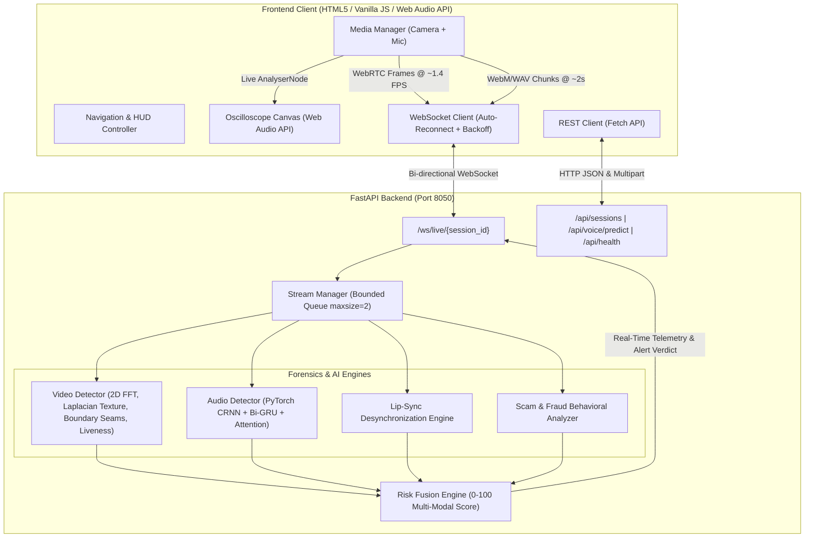

# 🛡️ DeepShield AI — Real-Time Deepfake Voice & Video Scam Detection System

[](https://www.python.org/)
[](https://fastapi.tiangolo.com/)
[](https://pytorch.org/)
[](https://opencv.org/)
[](https://websockets.readthedocs.io/)
[](https://github.com/surajkr12444-prog/DeepFake-Ai)

> **DeepShield AI** is an enterprise-grade, multi-modal deepfake detection and live scam defense platform. It combines **real-time computer vision forensics**, a **deep learning acoustic voice model (CRNN + Attention)**, and **authoritative risk fusion** to catch AI-manipulated faces and cloned synthetic voices in live video calls and recorded media.

---

## 📑 Table of Contents

- [System Architecture](#-system-architecture)
- [Key Features](#-key-features)
- [Dedicated Detection Studios](#-dedicated-detection-studios)
  - [1. ⬡ Live Surveillance Operations Center](#1--live-surveillance-operations-center)
  - [2. 📹 Video Recognition Forensic Studio](#2--video-recognition-forensic-studio)
  - [3. 🎙️ Voice Recognition Studio (CRNN Deepfake AI)](#3-️-voice-recognition-studio-crnn-deepfake-ai)
- [Project Directory Structure](#-project-directory-structure)
- [Installation & Quick Start](#-installation--quick-start)
- [API & WebSocket Reference](#-api--websocket-reference)
- [AI & Forensic Models](#-ai--forensic-models)
- [Automated Testing](#-automated-testing)
- [License & Authors](#-license--authors)

---

## 🏛️ System Architecture



---

## ✨ Key Features

- **Multi-Modal Risk Fusion Engine ($0 - 100$)**:
  Fuses visual frequency artifacts, skin micro-texture distortion, face seam boundaries, acoustic deepfake probabilities, and lip-sync markers into a unified risk index.
- **🚨 Red Caution / Red Alert System**:
  Instant visual warning siren and HUD banner that triggers the millisecond synthetic speech or video spoofing crosses suspicious thresholds.
- **Microphone Oscilloscope Spectrum**:
  Live real-time audio waveform visualizer powered by the browser's Web Audio API (`AnalyserNode`) rendered to an HTML5 canvas.
- **Zero-Backpressure WebSocket Pipeline**:
  Bounded frame queues with stale-frame dropping prevent lag, ensuring ultra-low latency during real-time calls.
- **Dropzone Audio & Video Inspection**:
  Analyze pre-recorded audio (WAV, MP3) and video files (MP4, WebM) without needing physical webcams or microphones.
- **12/12 Automated Integration Test Suite**:
  Fully verified end-to-end test suite testing sessions, audio predictions, WebSocket communication, and risk fusion.

---

## 🎯 Dedicated Detection Studios

### 1. ⬡ Live Surveillance Operations Center
* Combines **live video surveillance** and **audio capture** into a single dashboard.
* Displays the authoritative **Multi-Modal Threat Level**, live confidence charts, and the **Red Alert Caution Banner**.
* Displays hardware status badges for Camera and Microphone availability.

### 2. 📹 Video Recognition Forensic Studio
* **2D Fast Fourier Transform (FFT)**: Identifies high-frequency concentric spikes and periodic spectrum artifacts generated by GANs, StyleGAN, and Diffusion architectures.
* **Laplacian Gradient Smoothing**: Flags uncharacteristically smooth facial skin devoid of natural biological pores.
* **Boundary Mask Seam Disparity**: Inspects color space differences ($\Delta YCrCb$) along face boundary margins to expose face-swapping overlays.
* **Micro-Motion Temporal Liveness**: Prevents screen-replay and static photo replay attacks.

### 3. 🎙️ Voice Recognition Studio (CRNN Deepfake AI)
* **Neural Architecture**: Deep PyTorch model combining **ResNet-18 Backbone**, **Bi-directional GRU (2 layers)**, and **Multi-Head Attention Pooling**.
* **Model Checkpoint**: Loaded from `voice/models/best_model10.pth` (46.8 MB).
* **Live Acoustic Metrics**:
  * **Mel-Spectrogram Consistency**: Analyzes temporal and spectral continuity ($16\,\text{kHz}$, $n_{\text{fft}}=780$, $\text{hop}=195$, $64$ mels).
  * **Pitch Tremor / Micro-Jitter**: Measures human biological vocal micro-fluctuations.
  * **Phase Coherence**: Identifies phase vocoder and neural vocoder synthesis artifacts.
  * **GRU Sequence Match**: Bi-GRU temporal flow tracking.
* **Direct Audio Upload**: Drag-and-drop WAV or MP3 audio files for instant deepfake classification.
* **1-Click Presets**: Test authentic speech versus synthetic cloned speech with instant sample presets.

---

## 📂 Project Directory Structure

```
DeepFake-Ai/
├── run.py                              # One-click desktop launcher (starts backend + browser)
├── run_backend.bat                     # Windows 1-click execution batch script
├── requirements.txt                    # Python dependencies
├── README.md                           # Comprehensive documentation
│
├── Backend/                            # Modular Production Backend
│   ├── backend_server.py               # Main FastAPI entry point (port 8050)
│   ├── config.py                       # Configuration (CORS, model paths, port, rate limits)
│   ├── schemas.py                      # Pydantic schemas (sessions, streaming packets, risk fusion)
│   ├── test_e2e_pipeline.py            # Comprehensive 12/12 passing E2E test suite
│   │
│   ├── models/
│   │   └── audio_model.py              # CRNNWithAttn PyTorch neural network definition
│   │
│   ├── services/
│   │   ├── video_detector.py           # Multi-cue CV forensics (FFT, Laplacian, Seams, Liveness)
│   │   ├── audio_detector.py           # PyTorch audio inference & acoustic feature extractor
│   │   ├── lipsync_detector.py         # Visual-audio lip-sync desynchronization engine
│   │   ├── scam_detector.py            # Behavioral scam keyword & urgency heuristics
│   │   ├── risk_fusion.py              # Authoritative multi-modal threat fusion (0-100)
│   │   └── stream_manager.py           # WebSocket queue manager with stale-frame dropping
│   │
│   ├── routers/
│   │   ├── sessions.py                 # REST API endpoints (health, sessions, audio predict)
│   │   └── live_ws.py                  # Live streaming WebSocket endpoint (/ws/live/{session_id})
│   │
│   ├── refs/                           # Reference facial identity portraits
│   └── detection_log.csv               # Historical forensic audit log
│
├── Frontend/                           # Cyberpunk Forensic Dashboard
│   ├── index.html                      # Layout, Navigation switcher & Studio sections
│   ├── style.css                       # Glassmorphic dark styling & Red Caution siren animations
│   ├── config.js                       # Protocol resolution (http/https, ws/wss)
│   ├── api.js                          # REST API Client (health, session CRUD, voice upload)
│   ├── media.js                        # getUserMedia capture manager & audio chunk recorder
│   ├── websocket.js                    # Resilient WebSocket state machine with backoff
│   ├── ui.js                           # HUD rendering, gauges, and Red Alert banners
│   ├── surveillance.js                 # Master live surveillance coordinator
│   └── script.js                       # Studio switcher & Web Audio API oscilloscope logic
│
└── voice/                              # Voice Deepfake Models & Training Pipeline
    ├── models/
    │   └── best_model10.pth            # Trained PyTorch CRNN voice model (46.8 MB)
    ├── model_architecture.py           # Reference PyTorch network scripts
    ├── audio_deepfake_detector.py      # Standalone voice inference script
    ├── real_time_audio_detector.py     # Live audio stream detector
    ├── requirements.txt                # Voice-specific audio dependencies
    └── Dockerfile                      # Container definition for voice service
```

---

## 🚀 Installation & Quick Start

### 1. Prerequisites
- **Python 3.10+**
- **Git**
- Microphone & Webcam (optional, file upload testing available)

### 2. Clone the Repository
```bash
git clone https://github.com/surajkr12444-prog/DeepFake-Ai.git
cd DeepFake-Ai
```

### 3. Set Up Virtual Environment & Dependencies
```powershell
# Create virtual environment
python -m venv venv

# Activate virtual environment (Windows PowerShell)
.\venv\Scripts\Activate.ps1

# Activate virtual environment (Linux/macOS)
# source venv/bin/activate

# Install dependencies
pip install -r requirements.txt
```

### 4. Run DeepShield

#### Option A: One-Click Launcher (Recommended)
- **Windows**: Double-click **`run_backend.bat`**
- **Or via CLI**:
  ```powershell
  python run.py
  ```
  *This automatically launches the server and opens `http://localhost:8050` in your default browser.*

#### Option B: Manual Server Start
```powershell
python Backend/backend_server.py
```
Then navigate to **`http://localhost:8050`** in Google Chrome or any modern browser.

---

## 🔌 API & WebSocket Reference

### REST Endpoints

| Method | Endpoint | Description |
| :--- | :--- | :--- |
| `GET` | `/api/health` | System health check, active session count, model readiness. |
| `POST` | `/api/sessions` | Create a new live surveillance session. |
| `GET` | `/api/sessions/{session_id}` | Fetch session metadata and active status. |
| `DELETE` | `/api/sessions/{session_id}` | Close session and release buffer resources. |
| `POST` | `/api/voice/predict` | Upload an audio file (WAV/MP3) for instant CRNN deepfake evaluation. |
| `POST` | `/api/detect` | Single-frame image forensic inference. |
| `GET` | `/api/stats` | Aggregate forensic metrics (total scans, deepfakes blocked, avg latency). |
| `GET` | `/api/logs` | Query forensic audit logs with optional search filtering. |
| `GET` | `/api/export_csv` | Download detection audit logs as CSV. |
| `GET` | `/api/report` | Generate formatted forensic text audit report. |

### WebSocket Real-Time Stream

```
ws://localhost:8050/ws/live/{session_id}
```

#### Client Message Payload
```json
{
  "type": "frame",
  "data": "data:image/jpeg;base64,...",
  "audio": "data:audio/webm;base64,...",
  "client_timestamp": 1775584800000
}
```

#### Server Telemetry Response
```json
{
  "overall_risk_score": 87.4,
  "verdict": "CRITICAL_THREAT",
  "is_deepfake": true,
  "red_alert": true,
  "signals": {
    "video": {
      "score": 89.2,
      "fft_anomaly": 91.0,
      "skin_texture": 85.4,
      "seam_disparity": 78.1,
      "liveness": 95.0,
      "faces_detected": 1
    },
    "audio": {
      "score": 85.6,
      "label": "🚨 Synthetic Deepfake Voice",
      "model_confidence": 0.856,
      "spectral_consistency": 82.0,
      "pitch_tremor": 90.1,
      "phase_coherence": 84.7,
      "gru_sequence": 86.0
    },
    "lipsync": { "score": 75.0, "desync_ms": 120 },
    "scam": { "score": 80.0, "indicators": ["urgent_wire_transfer"] }
  },
  "explanation": "High probability of AI face manipulation and synthetic voice clone detected.",
  "latency_ms": 18.5
}
```

---

## 🧠 AI & Forensic Models

### Voice Forensics: PyTorch CRNN + Bi-GRU + Attention
* **Backbone**: Modified ResNet-18 feature extractor.
* **Temporal Modeling**: 2-layer Bi-Directional Gated Recurrent Unit (Bi-GRU, hidden dimension 128).
* **Attention Pooling**: Computes normalized attention weights over temporal frames to prioritize synthetic spectral anomalies.
* **Audio Preprocessing**: In-memory MelSpectrogram extraction ($16\,\text{kHz}$, $780$ FFT window, $195$ hop length, $64$ mel bands).
* **Weights**: Validated and loaded from `voice/models/best_model10.pth`.

### Video Forensics: Multi-Cue Visual Artifact Detector
1. **2D Radial Power Spectrum (FFT)**: Computes high-frequency energy ratio:
   $$\text{FFT Anomaly} = 1.0 - \min\left(1.0, \frac{\text{Radial High Energy}}{\text{Normal Roll-off Factor}}\right)$$
2. **Laplacian Skin Smoothing**: Compares gradient variances:
   $$\text{Smoothing Score} = \min\left(1.0, \frac{180.0}{\max(\sigma^2_{\text{Laplacian}}, 1.0)}\right)$$
3. **Boundary Seam Disparity**: Computes Euclidean distance in $YCrCb$ space between face contour and outer perimeter.
4. **Temporal Liveness**: Dynamic inter-frame standard deviation tracking over continuous frames.

---

## 🧪 Automated Testing

DeepShield includes a comprehensive integration test suite verifying the REST API, PyTorch model forward pass, session lifecycle, and WebSocket data flow.

Run the test suite using `pytest`:
```powershell
pytest Backend/test_e2e_pipeline.py -v
```

### Verified Test Suite (12/12 Passing):
* ✔️ `test_health_endpoint`: Server returns HTTP 200, healthy status, and model readiness.
* ✔️ `test_session_lifecycle`: Complete CRUD verification of session creation and deletion.
* ✔️ `test_audio_detector_initialization`: Verifies `CRNNWithAttn` model loads weights with `is_mock == False`.
* ✔️ `test_audio_detector_prediction`: Forward inference returns valid probabilities and acoustic features.
* ✔️ `test_video_detector_blank_frame`: Handles frames without faces gracefully without false positives.
* ✔️ `test_risk_fusion_scoring`: Validates weighted fusion calculation on a $0-100$ scale.
* ✔️ `test_voice_predict_endpoint_synthetic`: Verifies HTTP multipart voice upload API endpoint.
* ✔️ `test_websocket_connection_and_streaming`: Validates bi-directional WebSocket handshake and telemetry frames.
* ✔️ `test_stats_endpoint`: Verifies analytics and operational telemetry.
* ✔️ `test_logs_endpoint`: Verifies audit trail querying and filtering.
* ✔️ `test_export_csv_endpoint`: Verifies CSV download integrity.
* ✔️ `test_report_endpoint`: Verifies text forensic audit summary generation.

---

## 👥 Authors & Acknowledgments

- **Suraj Kumar** ([@surajkr12444-prog](https://github.com/surajkr12444-prog)) — System Architecture, Audio Model & Full-Stack Implementation
- Built for real-time scam prevention, live conference defense, and multi-modal forensic inspection.

---

## 📄 License
This project is licensed under the [MIT License](LICENSE).
